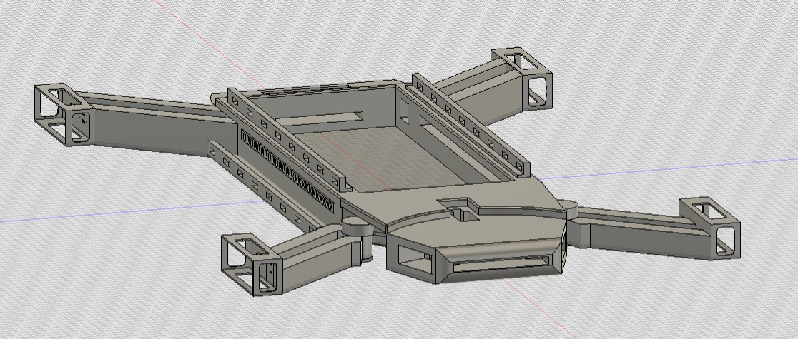
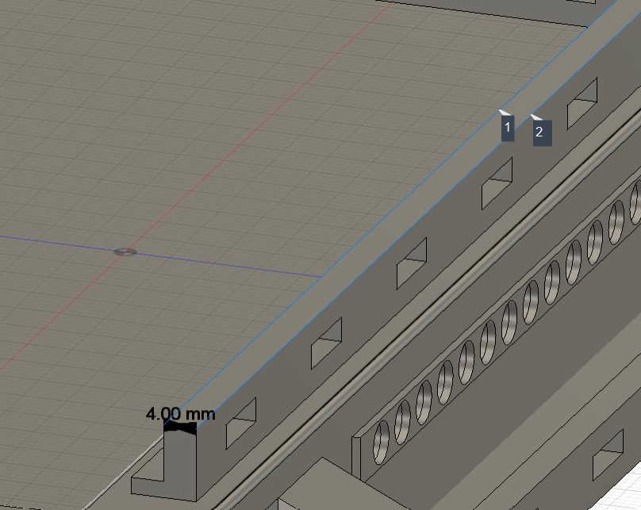

# modular-rc-vehicle
Work in progress!!!
This is a costum built RC vehicle. It has several version, but I'm planning to design it to be equipped with a "Quickmount system"
# quickmount-system
I'm designing a versatile "quicklink" for mounting different tools and sensors or modules to the car

The project is modular and more features will be added on the go (future features I'd like to add include: Temperature and other useful sensors, ultrasonic sensors, a display for displaying messages)

# 📂 Project Structure
- **Project Category:** Custom (Original Mechanical Design)
- **CAD V1:** [Download STEP File](Design/Frame.step)

# V1 - Design

# Modular RC Car with Wireless Control and LED Matrix

This project is a custom-built RC vehicle designed from scratch using modular electronics and software.

## Overview
The system consists of:
- A PC-based GUI for control and visualization
- A Raspberry Pi Pico acting as the communication bridge
- NRF24L01+PA+LNA modules for wireless transmission
- An Arduino Mega onboard the vehicle handling motors, steering, sensors, and LED output

## In Progress
- Wireless communication protocol
- Motor driver module 
- GUI pattern animation and custom LED pattern upload
- Improved mechanical design (planned 3D-printed parts)

## Why This Project
This project combines:
- Embedded systems (Arduino, Pico)
- Wireless communication
- Desktop software development
- Mechanical design under constraints
- Custom hardware abstraction libraries

## Planned Improvements
- Fully modular electronics stack
- 3D-printed mounts and enclosures
- Better steering geometry
- Expandable sensor system
